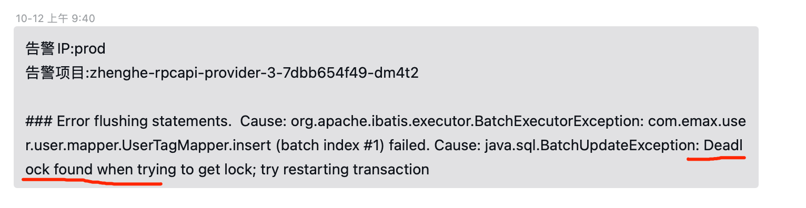
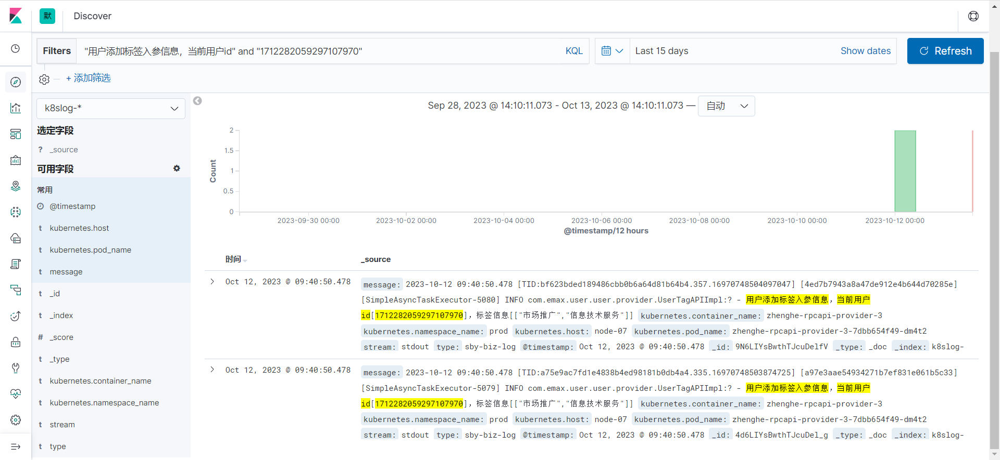

# MYSQL批量插入并发场景下的DEADLOCK

## 一、背景：
公元2023-10-12(周四)上午，过上线的时候，同事反馈，用户生成标签报死锁异常




## 二、排查异常日志
查到当时报错的日志


具体异常信息如下
```text
server-provider-info-2023-10-12.0.log:2023-10-12 09:40:50.593 [TID:bf623bded189486cbb0b6a64d81b64b4.357.16970748504097047] [4ed7b7943a8a47de912e4b644d70285e] [SimpleAsyncTaskExecutor-5080] INFO  com.emax.user.user.provider.UserTagAPIImpl:? - 签约完成，更新用户标签信息异常，用户id[1712282059297107970]org.apache.ibatis.exceptions.PersistenceException:
server-provider-info-2023-10-12.0.log-### Error flushing statements.  Cause: org.apache.ibatis.executor.BatchExecutorException: com.emax.user.user.mapper.UserTagMapper.insert (batch index #1) failed. Cause: java.sql.BatchUpdateException: Deadlock found when trying to get lock; try restarting transaction
server-provider-info-2023-10-12.0.log-### Cause: org.apache.ibatis.executor.BatchExecutorException: com.emax.user.user.mapper.UserTagMapper.insert (batch index #1)failed. Cause: java.sql.BatchUpdateException: Deadlock found when trying to get lock; try restarting transaction
server-provider-info-2023-10-12.0.log-  at org.apache.ibatis.exceptions.ExceptionFactory.wrapException(ExceptionFactory.java:30)
server-provider-info-2023-10-12.0.log-  at org.apache.ibatis.session.defaults.DefaultSqlSession.flushStatements(DefaultSqlSession.java:254)
server-provider-info-2023-10-12.0.log-  at com.baomidou.mybatisplus.extension.service.impl.ServiceImpl.saveBatch(ServiceImpl.java:127)
server-provider-info-2023-10-12.0.log-  at com.baomidou.mybatisplus.extension.service.IService.saveBatch(IService.java:58)
server-provider-info-2023-10-12.0.log-  at com.baomidou.mybatisplus.extension.service.IService$$FastClassBySpringCGLIB$$f8525d18.invoke(<generated>)
server-provider-info-2023-10-12.0.log-  at org.springframework.cglib.proxy.MethodProxy.invoke(MethodProxy.java:218)
server-provider-info-2023-10-12.0.log-  at org.springframework.aop.framework.CglibAopProxy$CglibMethodInvocation.invokeJoinpoint(CglibAopProxy.java:749)
server-provider-info-2023-10-12.0.log-  at org.springframework.aop.framework.ReflectiveMethodInvocation.proceed(ReflectiveMethodInvocation.java:163)
server-provider-info-2023-10-12.0.log-  at org.springframework.transaction.interceptor.TransactionAspectSupport.invokeWithinTransaction(TransactionAspectSupport.java:294)
server-provider-info-2023-10-12.0.log-  at org.springframework.transaction.interceptor.TransactionInterceptor.invoke(TransactionInterceptor.java:98)
server-provider-info-2023-10-12.0.log-  at org.springframework.aop.framework.ReflectiveMethodInvocation.proceed(ReflectiveMethodInvocation.java:186)
server-provider-info-2023-10-12.0.log-  at org.springframework.aop.framework.CglibAopProxy$DynamicAdvisedInterceptor.intercept(CglibAopProxy.java:688)
server-provider-info-2023-10-12.0.log-  at com.emax.user.user.service.UserTagManager$$EnhancerBySpringCGLIB$$67ca0067.saveBatch(<generated>)
server-provider-info-2023-10-12.0.log-  at com.emax.user.user.provider.UserTagAPIImpl.addUserTagByUser(UserTagAPIImpl.java:236)
server-provider-info-2023-10-12.0.log-  at com.emax.user.user.provider.UserTagAPIImpl.addTagAfterSign(UserTagAPIImpl.java:116)
server-provider-info-2023-10-12.0.log-  at com.emax.user.user.provider.UserTagAPIImpl$$FastClassBySpringCGLIB$$2547ce26.invoke(<generated>)
server-provider-info-2023-10-12.0.log-  at org.springframework.cglib.proxy.MethodProxy.invoke(MethodProxy.java:218)
server-provider-info-2023-10-12.0.log-  at org.springframework.aop.framework.CglibAopProxy$CglibMethodInvocation.invokeJoinpoint(CglibAopProxy.java:749)
--
server-provider-info-2023-10-12.0.log-  at io.seata.rm.datasource.StatementProxy.lambda$executeBatch$9(StatementProxy.java:129)
server-provider-info-2023-10-12.0.log-  at io.seata.rm.datasource.exec.ExecuteTemplate.execute(ExecuteTemplate.java:73)
server-provider-info-2023-10-12.0.log-  at io.seata.rm.datasource.exec.ExecuteTemplate.execute(ExecuteTemplate.java:51)
server-provider-info-2023-10-12.0.log-  at io.seata.rm.datasource.StatementProxy.executeBatch(StatementProxy.java:129)
server-provider-info-2023-10-12.0.log-  at sun.reflect.GeneratedMethodAccessor1346.invoke(Unknown Source)
server-provider-info-2023-10-12.0.log-  at sun.reflect.DelegatingMethodAccessorImpl.invoke(DelegatingMethodAccessorImpl.java:43)
server-provider-info-2023-10-12.0.log-  at java.lang.reflect.Method.invoke(Method.java:498)
server-provider-info-2023-10-12.0.log-  at org.apache.ibatis.logging.jdbc.PreparedStatementLogger.invoke(PreparedStatementLogger.java:78)
server-provider-info-2023-10-12.0.log-  at com.sun.proxy.$Proxy501.executeBatch(Unknown Source)
server-provider-info-2023-10-12.0.log-  at com.baomidou.mybatisplus.core.executor.MybatisBatchExecutor.doFlushStatements(MybatisBatchExecutor.java:132)
server-provider-info-2023-10-12.0.log-  ... 71 common frames omitted
server-provider-info-2023-10-12.0.log-Caused by: com.mysql.cj.jdbc.exceptions.MySQLTransactionRollbackException: Deadlock found when trying to get lock; try restarting transaction
server-provider-info-2023-10-12.0.log-  at com.mysql.cj.jdbc.exceptions.SQLError.createSQLException(SQLError.java:123)
server-provider-info-2023-10-12.0.log-  at com.mysql.cj.jdbc.exceptions.SQLError.createSQLException(SQLError.java:97)
server-provider-info-2023-10-12.0.log-  at com.mysql.cj.jdbc.exceptions.SQLExceptionsMapping.translateException(SQLExceptionsMapping.java:122)
server-provider-info-2023-10-12.0.log-  at com.mysql.cj.jdbc.ClientPreparedStatement.executeInternal(ClientPreparedStatement.java:970)
server-provider-info-2023-10-12.0.log-  at com.mysql.cj.jdbc.ClientPreparedStatement.executeUpdateInternal(ClientPreparedStatement.java:1109)
server-provider-info-2023-10-12.0.log-  at com.mysql.cj.jdbc.ClientPreparedStatement.executeBatchSerially(ClientPreparedStatement.java:849)
server-provider-info-2023-10-12.0.log-  ... 89 common frames omitted
server-provider-info-2023-10-12.0.log-
```

## 三、代码所在地
查看发生Deadlock的代码现场。

代码如下：
```java
    /**
     * 增加用户标签
     * @param user 用户信息
     * @param tagNameList 标签集合
     */
    private void addUserTagByUser(User user, List<String> tagNameList){
        log.info("用户添加标签入参信息，当前用户id[{}]，标签信息[{}]", user.getUserId(), JSON.toJSONString(tagNameList));
        Set<String> existTags = new HashSet<>();
        final List<UserTag> userTagList = userTagManager.listUserTagByUserId(user.getUserId());
        if(CollectionUtils.isNotEmpty(userTagList)){
            existTags = userTagList.stream().map(UserTag::getTagName).collect(Collectors.toSet());
        }
        //遍历合集 如果不存在旧数据 直接都新增 存在 判断当前数据是否在旧数据中
        List<UserTag> newInsertList = new ArrayList<>();
        for(String name : tagNameList){
            if (StringUtils.isNotBlank(name) && existTags.add(name)) {
                newInsertList.add(userTagManager.buildEntity(user.getUserId(), user.getIdcardNo(), name));
            }
        }
        userTagManager.saveBatch(newInsertList);
    }
```


观察代码，大致逻辑是，先根据用户id查询出所有标签信息，封装不存在的用户标签信息，批量入库。

推测是多个线程同时操作相同的数据，并发插入导致的死锁。


## 四、并发操作日志
elk上查询方法入参日志




果然在发生异常的时间节点上，发现了两条插入相同数据的日志。

找到当时另一个线程的操作日志


日志无异常，数据入库成功


## 五、数据库死锁日志验证推测
当天下午上班后，找运维大哥帮忙，找出死锁日志

执行命令show ENGINE INNODB status

得到信息如下

```text
=====================================
2023-10-12 13:49:17 0x7fea5ae87700 INNODB MONITOR OUTPUT
=====================================
Per second averages calculated from the last 61 seconds
-----------------
BACKGROUND THREAD
-----------------
srv_master_thread loops: 3123131 srv_active, 0 srv_shutdown, 7715544 srv_idle
srv_master_thread log flush and writes: 10838675
----------
SEMAPHORES
----------
OS WAIT ARRAY INFO: reservation count 3905404
OS WAIT ARRAY INFO: signal count 27617015
RW-shared spins 0, rounds 21456656, OS waits 2772950
RW-excl spins 0, rounds 41132727, OS waits 487320
RW-sx spins 227170, rounds 4363782, OS waits 66152
Spin rounds per wait: 21456656.00 RW-shared, 41132727.00 RW-excl, 19.21 RW-sx
------------------------
LATEST DETECTED DEADLOCK
------------------------
2023-10-12 09:40:50 0x7fecedb1e700
*** (1) TRANSACTION:
TRANSACTION 404898333, ACTIVE 0 sec inserting
mysql tables in use 1, locked 1
LOCK WAIT 2 lock struct(s), heap size 1136, 1 row lock(s), undo log entries 1
MySQL thread id 11375251, OS thread handle 140644580488960, query id 1031478425 10.128.0.160 emax_base update
INSERT INTO emax_user_tag  ( user_id,
id_card_no,
tag_name,
create_time,
update_time )  VALUES  ( 1712282059297107970,
'A978B69811B82F4B08F929D26B360F2D980CDCB5F419F1DD46527FB90BE1E5A9',
'市场推广',
'2023-10-12 09:40:50.481',
'2023-10-12 09:40:50.481' )
*** (1) WAITING FOR THIS LOCK TO BE GRANTED:
RECORD LOCKS space id 1155 page no 65295 n bits 312 index uniq_user_id_tag_name of table `emax_base`.`emax_user_tag` trx id 404898333 lock mode S waiting
Record lock, heap no 242 PHYSICAL RECORD: n_fields 3; compact format; info bits 0
 0: len 8; hex 97c33f75fbadb002; asc   ?u    ;;
 1: len 12; hex e5b882e59cbae68ea8e5b9bf; asc             ;;
 2: len 8; hex 000000000044c0da; asc      D  ;;

*** (2) TRANSACTION:
TRANSACTION 404898332, ACTIVE 0 sec inserting
mysql tables in use 1, locked 1
3 lock struct(s), heap size 1136, 2 row lock(s), undo log entries 2
MySQL thread id 11375224, OS thread handle 140655576868608, query id 1031478426 10.128.0.160 emax_base update
INSERT INTO emax_user_tag  ( user_id,
id_card_no,
tag_name,
create_time,
update_time )  VALUES  ( 1712282059297107970,
'A978B69811B82F4B08F929D26B360F2D980CDCB5F419F1DD46527FB90BE1E5A9',
'信息技术服务',
'2023-10-12 09:40:50.481',
'2023-10-12 09:40:50.481' )
*** (2) HOLDS THE LOCK(S):
RECORD LOCKS space id 1155 page no 65295 n bits 312 index uniq_user_id_tag_name of table `emax_base`.`emax_user_tag` trx id 404898332 lock_mode X locks rec but not gap
Record lock, heap no 242 PHYSICAL RECORD: n_fields 3; compact format; info bits 0
 0: len 8; hex 97c33f75fbadb002; asc   ?u    ;;
 1: len 12; hex e5b882e59cbae68ea8e5b9bf; asc             ;;
 2: len 8; hex 000000000044c0da; asc      D  ;;

*** (2) WAITING FOR THIS LOCK TO BE GRANTED:
RECORD LOCKS space id 1155 page no 65295 n bits 312 index uniq_user_id_tag_name of table `emax_base`.`emax_user_tag` trx id 404898332 lock_mode X locks gap before rec insert intention waiting
Record lock, heap no 242 PHYSICAL RECORD: n_fields 3; compact format; info bits 0
 0: len 8; hex 97c33f75fbadb002; asc   ?u    ;;
 1: len 12; hex e5b882e59cbae68ea8e5b9bf; asc             ;;
 2: len 8; hex 000000000044c0da; asc      D  ;;

*** WE ROLL BACK TRANSACTION (1)
------------
TRANSACTIONS
------------
Trx id counter 405024559
Purge done for trx's n:o < 405024559 undo n:o < 0 state: running but idle
History list length 37
LIST OF TRANSACTIONS FOR EACH SESSION:
---TRANSACTION 422146443693728, not started
0 lock struct(s), heap size 1136, 0 row lock(s)
---TRANSACTION 422146443690080, not started
0 lock struct(s), heap size 1136, 0 row lock(s)
---TRANSACTION 422146443689168, not started
0 lock struct(s), heap size 1136, 0 row lock(s)
---TRANSACTION 422146443673664, not started
0 lock struct(s), heap size 1136, 0 row lock(s)
---TRANSACTION 422146443667280, not started
0 lock struct(s), heap size 1136, 0 row lock(s)
---TRANSACTION 422146443680048, not started
0 lock struct(s), heap size 1136, 0 row lock(s)
---TRANSACTION 422146443669104, not started
0 lock struct(s), heap size 1136, 0 row lock(s)
---TRANSACTION 422146443671840, not started
0 lock struct(s), heap size 1136, 0 row lock(s)
---TRANSACTION 422146443698288, not started
0 lock struct(s), heap size 1136, 0 row lock(s)
---TRANSACTION 422146443696464, not started
0 lock struct(s), heap size 1136, 0 row lock(s)
---TRANSACTION 422146443695552, not started
0 lock struct(s), heap size 1136, 0 row lock(s)
---TRANSACTION 422146443694640, not started
0 lock struct(s), heap size 1136, 0 row lock(s)
---TRANSACTION 422146443692816, not started
0 lock struct(s), heap size 1136, 0 row lock(s)
---TRANSACTION 422146443688256, not started
0 lock struct(s), heap size 1136, 0 row lock(s)
---TRANSACTION 422146443686432, not started
0 lock struct(s), heap size 1136, 0 row lock(s)
---TRANSACTION 422146443681872, not started
0 lock struct(s), heap size 1136, 0 row lock(s)
---TRANSACTION 422146443676400, not started
0 lock struct(s), heap size 1136, 0 row lock(s)
---TRANSACTION 422146443675488, not started
0 lock struct(s), heap size 1136, 0 row lock(s)
---TRANSACTION 422146443690992, not started
0 lock struct(s), heap size 1136, 0 row lock(s)
---TRANSACTION 422146443679136, not started
0 lock struct(s), heap size 1136, 0 row lock(s)
---TRANSACTION 422146443668192, not started
0 lock struct(s), heap size 1136, 0 row lock(s)
---TRANSACTION 422146443680960, not started
0 lock struct(s), heap size 1136, 0 row lock(s)
---TRANSACTION 422146443682784, not started
0 lock struct(s), heap size 1136, 0 row lock(s)
---TRANSACTION 422146443705584, not started
0 lock struct(s), heap size 1136, 0 row lock(s)
---TRANSACTION 422146443697376, not started
0 lock struct(s), heap size 1136, 0 row lock(s)
---TRANSACTION 422146443677312, not started
0 lock struct(s), heap size 1136, 0 row lock(s)
---TRANSACTION 422146443672752, not started
0 lock struct(s), heap size 1136, 0 row lock(s)
---TRANSACTION 422146443670928, not started
0 lock struct(s), heap size 1136, 0 row lock(s)
---TRANSACTION 422146443674576, not started
0 lock struct(s), heap size 1136, 0 row lock(s)
---TRANSACTION 422146443687344, not started
0 lock struct(s), heap size 1136, 0 row lock(s)
---TRANSACTION 422146443683696, not started
0 lock struct(s), heap size 1136, 0 row lock(s)
---TRANSACTION 422146443678224, not started
0 lock struct(s), heap size 1136, 0 row lock(s)
---TRANSACTION 422146443709232, not started
0 lock struct(s), heap size 1136, 0 row lock(s)
---TRANSACTION 422146443708320, not started
0 lock struct(s), heap size 1136, 0 row lock(s)
---TRANSACTION 422146443704672, not started
0 lock struct(s), heap size 1136, 0 row lock(s)
---TRANSACTION 422146443691904, not started
0 lock struct(s), heap size 1136, 0 row lock(s)
---TRANSACTION 422146443684608, not started
0 lock struct(s), heap size 1136, 0 row lock(s)
---TRANSACTION 422146443722000, not started
0 lock struct(s), heap size 1136, 0 row lock(s)
---TRANSACTION 422146443721088, not started
0 lock struct(s), heap size 1136, 0 row lock(s)
---TRANSACTION 422146443720176, not started
0 lock struct(s), heap size 1136, 0 row lock(s)
---TRANSACTION 422146443670016, not started
0 lock struct(s), heap size 1136, 0 row lock(s)
---TRANSACTION 422146443717440, not started
0 lock struct(s), heap size 1136, 0 row lock(s)
---TRANSACTION 422146443715616, not started
0 lock struct(s), heap size 1136, 0 row lock(s)
---TRANSACTION 422146443713792, not started
0 lock struct(s), heap size 1136, 0 row lock(s)
---TRANSACTION 422146443712880, not started
0 lock struct(s), heap size 1136, 0 row lock(s)
---TRANSACTION 422146443711968, not started
0 lock struct(s), heap size 1136, 0 row lock(s)
---TRANSACTION 422146443711056, not started
0 lock struct(s), heap size 1136, 0 row lock(s)
---TRANSACTION 422146443710144, not started
0 lock struct(s), heap size 1136, 0 row lock(s)
---TRANSACTION 422146443685520, not started
0 lock struct(s), heap size 1136, 0 row lock(s)
--------
FILE I/O
--------
I/O thread 0 state: waiting for completed aio requests (insert buffer thread)
I/O thread 1 state: waiting for completed aio requests (log thread)
I/O thread 2 state: waiting for completed aio requests (read thread)
I/O thread 3 state: waiting for completed aio requests (read thread)
I/O thread 4 state: waiting for completed aio requests (read thread)
I/O thread 5 state: waiting for completed aio requests (read thread)
I/O thread 6 state: waiting for completed aio requests (write thread)
I/O thread 7 state: waiting for completed aio requests (write thread)
I/O thread 8 state: waiting for completed aio requests (write thread)
I/O thread 9 state: waiting for completed aio requests (write thread)
Pending normal aio reads: [0, 0, 0, 0] , aio writes: [0, 0, 0, 0] ,
 ibuf aio reads:, log i/o's:, sync i/o's:
Pending flushes (fsync) log: 0; buffer pool: 0
28323636 OS file reads, 182578179 OS file writes, 71694946 OS fsyncs
0.26 reads/s, 16384 avg bytes/read, 139.54 writes/s, 3.20 fsyncs/s
-------------------------------------
INSERT BUFFER AND ADAPTIVE HASH INDEX
-------------------------------------
Ibuf: size 1, free list len 11501, seg size 11503, 1689905 merges
merged operations:
 insert 2709888, delete mark 34456, delete 9214
discarded operations:
 insert 0, delete mark 0, delete 0
Hash table size 3718607, node heap has 2695 buffer(s)
Hash table size 3718607, node heap has 391 buffer(s)
Hash table size 3718607, node heap has 12207 buffer(s)
Hash table size 3718607, node heap has 160 buffer(s)
Hash table size 3718607, node heap has 5812 buffer(s)
Hash table size 3718607, node heap has 255 buffer(s)
Hash table size 3718607, node heap has 3139 buffer(s)
Hash table size 3718607, node heap has 71 buffer(s)
3143.16 hash searches/s, 282.80 non-hash searches/s
---
LOG
---
Log sequence number 395776070603
Log flushed up to   395776070476
Pages flushed up to 395775879641
Last checkpoint at  395775879641
0 pending log flushes, 0 pending chkp writes
44923739 log i/o's done, 1.77 log i/o's/second
----------------------
BUFFER POOL AND MEMORY
----------------------
Total large memory allocated 15392047104
Dictionary memory allocated 1525189
Buffer pool size   917448
Free buffers       8192
Database pages     884526
Old database pages 326351
Modified db pages  3075
Pending reads      0
Pending writes: LRU 0, flush list 0, single page 0
Pages made young 86155146, not young 457923182
0.00 youngs/s, 0.00 non-youngs/s
Pages read 28242849, created 3693517, written 127480625
0.00 reads/s, 0.00 creates/s, 0.00 writes/s
Buffer pool hit rate 1000 / 1000, young-making rate 0 / 1000 not 0 / 1000
Pages read ahead 0.00/s, evicted without access 0.00/s, Random read ahead 0.00/s
LRU len: 884526, unzip_LRU len: 0
I/O sum[52624]:cur[0], unzip sum[0]:cur[0]
----------------------
INDIVIDUAL BUFFER POOL INFO
----------------------
---BUFFER POOL 0
Buffer pool size   114688
Free buffers       1024
Database pages     110593
Old database pages 40804
Modified db pages  710
Pending reads      0
Pending writes: LRU 0, flush list 0, single page 0
Pages made young 10667711, not young 57343017
0.00 youngs/s, 0.00 non-youngs/s
Pages read 3482959, created 463601, written 24686918
0.00 reads/s, 0.00 creates/s, 0.00 writes/s
Buffer pool hit rate 1000 / 1000, young-making rate 0 / 1000 not 0 / 1000
Pages read ahead 0.00/s, evicted without access 0.00/s, Random read ahead 0.00/s
LRU len: 110593, unzip_LRU len: 0
I/O sum[6578]:cur[0], unzip sum[0]:cur[0]
---BUFFER POOL 1
Buffer pool size   114674
Free buffers       1024
Database pages     110617
Old database pages 40813
Modified db pages  349
Pending reads      0
Pending writes: LRU 0, flush list 0, single page 0
Pages made young 10693433, not young 56307979
0.00 youngs/s, 0.00 non-youngs/s
Pages read 3455863, created 459299, written 14096123
0.00 reads/s, 0.00 creates/s, 0.00 writes/s
Buffer pool hit rate 1000 / 1000, young-making rate 0 / 1000 not 0 / 1000
Pages read ahead 0.00/s, evicted without access 0.00/s, Random read ahead 0.00/s
LRU len: 110617, unzip_LRU len: 0
I/O sum[6578]:cur[0], unzip sum[0]:cur[0]
---BUFFER POOL 2
Buffer pool size   114688
Free buffers       1024
Database pages     110597
Old database pages 40805
Modified db pages  295
Pending reads      0
Pending writes: LRU 0, flush list 0, single page 0
Pages made young 10951294, not young 55820586
0.00 youngs/s, 0.00 non-youngs/s
Pages read 3451748, created 464038, written 13162062
0.00 reads/s, 0.00 creates/s, 0.00 writes/s
Buffer pool hit rate 1000 / 1000, young-making rate 0 / 1000 not 0 / 1000
Pages read ahead 0.00/s, evicted without access 0.00/s, Random read ahead 0.00/s
LRU len: 110597, unzip_LRU len: 0
I/O sum[6578]:cur[0], unzip sum[0]:cur[0]
---BUFFER POOL 3
Buffer pool size   114674
Free buffers       1024
Database pages     110525
Old database pages 40779
Modified db pages  466
Pending reads      0
Pending writes: LRU 0, flush list 0, single page 0
Pages made young 10947489, not young 58292426
0.00 youngs/s, 0.00 non-youngs/s
Pages read 3694497, created 467309, written 18645733
0.00 reads/s, 0.00 creates/s, 0.00 writes/s
Buffer pool hit rate 1000 / 1000, young-making rate 0 / 1000 not 0 / 1000
Pages read ahead 0.00/s, evicted without access 0.00/s, Random read ahead 0.00/s
LRU len: 110525, unzip_LRU len: 0
I/O sum[6578]:cur[0], unzip sum[0]:cur[0]
---BUFFER POOL 4
Buffer pool size   114688
Free buffers       1024
Database pages     110538
Old database pages 40784
Modified db pages  252
Pending reads      0
Pending writes: LRU 0, flush list 0, single page 0
Pages made young 10845826, not young 56836947
0.00 youngs/s, 0.00 non-youngs/s
Pages read 3601069, created 463152, written 14864735
0.00 reads/s, 0.00 creates/s, 0.00 writes/s
Buffer pool hit rate 1000 / 1000, young-making rate 0 / 1000 not 0 / 1000
Pages read ahead 0.00/s, evicted without access 0.00/s, Random read ahead 0.00/s
LRU len: 110538, unzip_LRU len: 0
I/O sum[6578]:cur[0], unzip sum[0]:cur[0]
---BUFFER POOL 5
Buffer pool size   114674
Free buffers       1024
Database pages     110548
Old database pages 40787
Modified db pages  265
Pending reads      0
Pending writes: LRU 0, flush list 0, single page 0
Pages made young 10838154, not young 56527001
0.00 youngs/s, 0.00 non-youngs/s
Pages read 3472060, created 458599, written 13775107
0.00 reads/s, 0.00 creates/s, 0.00 writes/s
Buffer pool hit rate 1000 / 1000, young-making rate 0 / 1000 not 0 / 1000
Pages read ahead 0.00/s, evicted without access 0.00/s, Random read ahead 0.00/s
LRU len: 110548, unzip_LRU len: 0
I/O sum[6578]:cur[0], unzip sum[0]:cur[0]
---BUFFER POOL 6
Buffer pool size   114688
Free buffers       1024
Database pages     110566
Old database pages 40794
Modified db pages  360
Pending reads      0
Pending writes: LRU 0, flush list 0, single page 0
Pages made young 10485124, not young 58383968
0.00 youngs/s, 0.00 non-youngs/s
Pages read 3621901, created 457805, written 14276768
0.00 reads/s, 0.00 creates/s, 0.00 writes/s
Buffer pool hit rate 1000 / 1000, young-making rate 0 / 1000 not 0 / 1000
Pages read ahead 0.00/s, evicted without access 0.00/s, Random read ahead 0.00/s
LRU len: 110566, unzip_LRU len: 0
I/O sum[6578]:cur[0], unzip sum[0]:cur[0]
---BUFFER POOL 7
Buffer pool size   114674
Free buffers       1024
Database pages     110542
Old database pages 40785
Modified db pages  378
Pending reads      0
Pending writes: LRU 0, flush list 0, single page 0
Pages made young 10726115, not young 58411258
0.00 youngs/s, 0.00 non-youngs/s
Pages read 3462752, created 459714, written 13973179
0.00 reads/s, 0.00 creates/s, 0.00 writes/s
Buffer pool hit rate 1000 / 1000, young-making rate 0 / 1000 not 0 / 1000
Pages read ahead 0.00/s, evicted without access 0.00/s, Random read ahead 0.00/s
LRU len: 110542, unzip_LRU len: 0
I/O sum[6578]:cur[0], unzip sum[0]:cur[0]
--------------
ROW OPERATIONS
--------------
0 queries inside InnoDB, 0 queries in queue
0 read views open inside InnoDB
Process ID=1351, Main thread ID=140655772174080, state: sleeping
Number of rows inserted 8669417751, updated 35446031, deleted 1362347, read 1171048260299
0.48 inserts/s, 0.70 updates/s, 0.00 deletes/s, 87655.42 reads/s
----------------------------
END OF INNODB MONITOR OUTPUT
============================
```


该日志信息量很多，我们主要关注最后一次死锁相关信息。

## 六、死锁复现
sql准备

```sql
INSERT INTO emax_user_tag ( user_id, id_card_no, tag_name, create_time, update_time ) VALUES ( 1712282059297107970, 'A978B69811B82F4B08F929D26B360F2D980CDCB5F419F1DD46527FB90BE1E5A9', '市场推广', '2023-10-12 09:40:50.481', '2023-10-12 09:40:50.481' );

INSERT INTO emax_user_tag ( user_id, id_card_no, tag_name, create_time, update_time ) VALUES ( 1712282059297107970, 'A978B69811B82F4B08F929D26B360F2D980CDCB5F419F1DD46527FB90BE1E5A9', '信息技术服务', '2023-10-12 09:40:50.481', '2023-10-12 09:40:50.481' );
```
本地创建一个和生产一样的数据库emax_user_tag


### 操作步骤1
在窗口一执行

```sql
begin;

INSERT INTO emax_user_tag ( user_id, id_card_no, tag_name, create_time, update_time ) VALUES ( 1712282059297107970, 'A978B69811B82F4B08F929D26B360F2D980CDCB5F419F1DD46527FB90BE1E5A9', '市场推广', '2023-10-12 09:40:50.481', '2023-10-12 09:40:50.481' );
```


### 操作步骤2
在窗口二执行

```sql
begin;

INSERT INTO emax_user_tag ( user_id, id_card_no, tag_name, create_time, update_time ) VALUES ( 1712282059297107970, 'A978B69811B82F4B08F929D26B360F2D980CDCB5F419F1DD46527FB90BE1E5A9', '市场推广', '2023-10-12 09:40:50.481', '2023-10-12 09:40:50.481' );
```


### 操作步骤3
在窗口一执行
```sql
INSERT INTO emax_user_tag ( user_id, id_card_no, tag_name, create_time, update_time ) VALUES ( 1712282059297107970, 'A978B69811B82F4B08F929D26B360F2D980CDCB5F419F1DD46527FB90BE1E5A9', '信息技术服务', '2023-10-12 09:40:50.481', '2023-10-12 09:40:50.481' );

commit;
```


### 操作步骤4
切回窗口二


### 操作步骤5
执行命令show ENGINE INNODB status查看死锁日志


```text
=====================================
2023-10-13 14:52:43 0x7fe759575700 INNODB MONITOR OUTPUT
=====================================
Per second averages calculated from the last 24 seconds
-----------------
BACKGROUND THREAD
-----------------
srv_master_thread loops: 137590 srv_active, 0 srv_shutdown, 2010475 srv_idle
srv_master_thread log flush and writes: 2148065
----------
SEMAPHORES
----------
OS WAIT ARRAY INFO: reservation count 6627679
OS WAIT ARRAY INFO: signal count 14339066
RW-shared spins 0, rounds 22104735, OS waits 1859432
RW-excl spins 0, rounds 258795010, OS waits 2238669
RW-sx spins 6551822, rounds 136672247, OS waits 1786313
Spin rounds per wait: 22104735.00 RW-shared, 258795010.00 RW-excl, 20.86 RW-sx
------------------------
LATEST DETECTED DEADLOCK
------------------------
2023-10-13 14:50:31 0x7fe892ad0700
*** (1) TRANSACTION:
TRANSACTION 293171186, ACTIVE 10 sec inserting
mysql tables in use 1, locked 1
LOCK WAIT 2 lock struct(s), heap size 1136, 1 row lock(s), undo log entries 1
MySQL thread id 1266048, OS thread handle 140631613069056, query id 35172347 192.168.48.179 develop update
/* ApplicationName=DBeaver 22.2.1 - SQLEditor <Script-4.sql> */ INSERT INTO emax_user_tag ( user_id, id_card_no, tag_name, create_time, update_time ) VALUES ( 1712282059297107970, 'A978B69811B82F4B08F929D26B360F2D980CDCB5F419F1DD46527FB90BE1E5A9', '市场推广', '2023-10-12 09:40:50.481', '2023-10-12 09:40:50.481' )
*** (1) WAITING FOR THIS LOCK TO BE GRANTED:
RECORD LOCKS space id 14171 page no 4 n bits 72 index user_id_tag_name of table `dbsyncer_mf`.`emax_user_tag` trx id 293171186 lock mode S waiting
Record lock, heap no 2 PHYSICAL RECORD: n_fields 3; compact format; info bits 0
 0: len 8; hex 97c33f75fbadb002; asc   ?u    ;;
 1: len 12; hex e5b882e59cbae68ea8e5b9bf; asc             ;;
 2: len 8; hex 80000000000358d0; asc       X ;;

*** (2) TRANSACTION:
TRANSACTION 293171182, ACTIVE 19 sec inserting
mysql tables in use 1, locked 1
3 lock struct(s), heap size 1136, 2 row lock(s), undo log entries 2
MySQL thread id 1266036, OS thread handle 140636869953280, query id 35172492 192.168.48.179 develop update
/* ApplicationName=DBeaver 22.2.1 - SQLEditor <Script-1.sql> */ INSERT INTO emax_user_tag ( user_id, id_card_no, tag_name, create_time, update_time ) VALUES ( 1712282059297107970, 'A978B69811B82F4B08F929D26B360F2D980CDCB5F419F1DD46527FB90BE1E5A9', '信息技术服务', '2023-10-12 09:40:50.481', '2023-10-12 09:40:50.481' )
*** (2) HOLDS THE LOCK(S):
RECORD LOCKS space id 14171 page no 4 n bits 72 index user_id_tag_name of table `dbsyncer_mf`.`emax_user_tag` trx id 293171182 lock_mode X locks rec but not gap
Record lock, heap no 2 PHYSICAL RECORD: n_fields 3; compact format; info bits 0
 0: len 8; hex 97c33f75fbadb002; asc   ?u    ;;
 1: len 12; hex e5b882e59cbae68ea8e5b9bf; asc             ;;
 2: len 8; hex 80000000000358d0; asc       X ;;

*** (2) WAITING FOR THIS LOCK TO BE GRANTED:
RECORD LOCKS space id 14171 page no 4 n bits 72 index user_id_tag_name of table `dbsyncer_mf`.`emax_user_tag` trx id 293171182 lock_mode X locks gap before rec insert intention waiting
Record lock, heap no 2 PHYSICAL RECORD: n_fields 3; compact format; info bits 0
 0: len 8; hex 97c33f75fbadb002; asc   ?u    ;;
 1: len 12; hex e5b882e59cbae68ea8e5b9bf; asc             ;;
 2: len 8; hex 80000000000358d0; asc       X ;;

*** WE ROLL BACK TRANSACTION (1)
------------
TRANSACTIONS
------------
Trx id counter 293171313
Purge done for trx's n:o < 293171307 undo n:o < 0 state: running but idle
History list length 37
LIST OF TRANSACTIONS FOR EACH SESSION:
---TRANSACTION 422113412462416, not started
0 lock struct(s), heap size 1136, 0 row lock(s)
---TRANSACTION 422113412560912, not started
0 lock struct(s), heap size 1136, 0 row lock(s)
---TRANSACTION 422113412496160, not started
0 lock struct(s), heap size 1136, 0 row lock(s)
---TRANSACTION 422113412508016, not started
0 lock struct(s), heap size 1136, 0 row lock(s)
---TRANSACTION 422113412473360, not started
0 lock struct(s), heap size 1136, 0 row lock(s)
---TRANSACTION 422113412463328, not started
0 lock struct(s), heap size 1136, 0 row lock(s)
---TRANSACTION 422113412521696, not started
0 lock struct(s), heap size 1136, 0 row lock(s)
---TRANSACTION 422113412477920, not started
0 lock struct(s), heap size 1136, 0 row lock(s)
---TRANSACTION 422113412466976, not started
0 lock struct(s), heap size 1136, 0 row lock(s)
---TRANSACTION 422113412568208, not started
0 lock struct(s), heap size 1136, 0 row lock(s)
---TRANSACTION 422113412567296, not started
0 lock struct(s), heap size 1136, 0 row lock(s)
---TRANSACTION 422113412566384, not started
0 lock struct(s), heap size 1136, 0 row lock(s)
---TRANSACTION 422113412565472, not started
0 lock struct(s), heap size 1136, 0 row lock(s)
---TRANSACTION 422113412562736, not started
0 lock struct(s), heap size 1136, 0 row lock(s)
---TRANSACTION 422113412560000, not started
0 lock struct(s), heap size 1136, 0 row lock(s)
---TRANSACTION 422113412559088, not started
0 lock struct(s), heap size 1136, 0 row lock(s)
---TRANSACTION 422113412533552, not started
0 lock struct(s), heap size 1136, 0 row lock(s)
---TRANSACTION 422113412524432, not started
0 lock struct(s), heap size 1136, 0 row lock(s)
---TRANSACTION 422113412520784, not started
0 lock struct(s), heap size 1136, 0 row lock(s)
---TRANSACTION 422113412476096, not started
0 lock struct(s), heap size 1136, 0 row lock(s)
---TRANSACTION 422113412551792, not started
0 lock struct(s), heap size 1136, 0 row lock(s)
---TRANSACTION 422113412543584, not started
0 lock struct(s), heap size 1136, 0 row lock(s)
---TRANSACTION 422113412522608, not started
0 lock struct(s), heap size 1136, 0 row lock(s)
---TRANSACTION 422113412468800, not started
0 lock struct(s), heap size 1136, 0 row lock(s)
---TRANSACTION 422113412530816, not started
0 lock struct(s), heap size 1136, 0 row lock(s)
---TRANSACTION 422113412523520, not started
0 lock struct(s), heap size 1136, 0 row lock(s)
---TRANSACTION 422113412513488, not started
0 lock struct(s), heap size 1136, 0 row lock(s)
---TRANSACTION 422113412501632, not started
0 lock struct(s), heap size 1136, 0 row lock(s)
---TRANSACTION 422113412491600, not started
0 lock struct(s), heap size 1136, 0 row lock(s)
---TRANSACTION 422113412483392, not started
0 lock struct(s), heap size 1136, 0 row lock(s)
---TRANSACTION 422113412477008, not started
0 lock struct(s), heap size 1136, 0 row lock(s)
---TRANSACTION 422113412471536, not started
0 lock struct(s), heap size 1136, 0 row lock(s)
---TRANSACTION 422113412465152, not started
0 lock struct(s), heap size 1136, 0 row lock(s)
---TRANSACTION 422113412488864, not started
0 lock struct(s), heap size 1136, 0 row lock(s)
---TRANSACTION 422113412482480, not started
0 lock struct(s), heap size 1136, 0 row lock(s)
---TRANSACTION 422113412528080, not started
0 lock struct(s), heap size 1136, 0 row lock(s)
---TRANSACTION 422113412497984, not started
0 lock struct(s), heap size 1136, 0 row lock(s)
---TRANSACTION 422113412492512, not started
0 lock struct(s), heap size 1136, 0 row lock(s)
---TRANSACTION 422113412500720, not started
0 lock struct(s), heap size 1136, 0 row lock(s)
---TRANSACTION 422113412499808, not started
0 lock struct(s), heap size 1136, 0 row lock(s)
---TRANSACTION 422113412498896, not started
0 lock struct(s), heap size 1136, 0 row lock(s)
---TRANSACTION 422113412494336, not started
0 lock struct(s), heap size 1136, 0 row lock(s)
---TRANSACTION 422113412469712, not started
0 lock struct(s), heap size 1136, 0 row lock(s)
---TRANSACTION 422113412464240, not started
0 lock struct(s), heap size 1136, 0 row lock(s)
---TRANSACTION 422113412558176, not started
0 lock struct(s), heap size 1136, 0 row lock(s)
---TRANSACTION 422113412557264, not started
0 lock struct(s), heap size 1136, 0 row lock(s)
---TRANSACTION 422113412556352, not started
0 lock struct(s), heap size 1136, 0 row lock(s)
---TRANSACTION 422113412555440, not started
0 lock struct(s), heap size 1136, 0 row lock(s)
---TRANSACTION 422113412553616, not started
0 lock struct(s), heap size 1136, 0 row lock(s)
---TRANSACTION 422113412549968, not started
0 lock struct(s), heap size 1136, 0 row lock(s)
---TRANSACTION 422113412549056, not started
0 lock struct(s), heap size 1136, 0 row lock(s)
---TRANSACTION 422113412548144, not started
0 lock struct(s), heap size 1136, 0 row lock(s)
---TRANSACTION 422113412542672, not started
0 lock struct(s), heap size 1136, 0 row lock(s)
---TRANSACTION 422113412541760, not started
0 lock struct(s), heap size 1136, 0 row lock(s)
---TRANSACTION 422113412539024, not started
0 lock struct(s), heap size 1136, 0 row lock(s)
---TRANSACTION 422113412538112, not started
0 lock struct(s), heap size 1136, 0 row lock(s)
---TRANSACTION 422113412529904, not started
0 lock struct(s), heap size 1136, 0 row lock(s)
---TRANSACTION 422113412526256, not started
0 lock struct(s), heap size 1136, 0 row lock(s)
---TRANSACTION 422113412518960, not started
0 lock struct(s), heap size 1136, 0 row lock(s)
---TRANSACTION 422113412516224, not started
0 lock struct(s), heap size 1136, 0 row lock(s)
---TRANSACTION 422113412509840, not started
0 lock struct(s), heap size 1136, 0 row lock(s)
---TRANSACTION 422113412508928, not started
0 lock struct(s), heap size 1136, 0 row lock(s)
---TRANSACTION 422113412507104, not started
0 lock struct(s), heap size 1136, 0 row lock(s)
---TRANSACTION 422113412472448, not started
0 lock struct(s), heap size 1136, 0 row lock(s)
---TRANSACTION 422113412505280, not started
0 lock struct(s), heap size 1136, 0 row lock(s)
---TRANSACTION 422113412504368, not started
0 lock struct(s), heap size 1136, 0 row lock(s)
---TRANSACTION 422113412503456, not started
0 lock struct(s), heap size 1136, 0 row lock(s)
---TRANSACTION 422113412502544, not started
0 lock struct(s), heap size 1136, 0 row lock(s)
---TRANSACTION 422113412485216, not started
0 lock struct(s), heap size 1136, 0 row lock(s)
---TRANSACTION 422113412480656, not started
0 lock struct(s), heap size 1136, 0 row lock(s)
---TRANSACTION 422113412487952, not started
0 lock struct(s), heap size 1136, 0 row lock(s)
---TRANSACTION 422113412478832, not started
0 lock struct(s), heap size 1136, 0 row lock(s)
---TRANSACTION 422113412474272, not started
0 lock struct(s), heap size 1136, 0 row lock(s)
---TRANSACTION 422113412554528, not started
0 lock struct(s), heap size 1136, 0 row lock(s)
---TRANSACTION 422113412552704, not started
0 lock struct(s), heap size 1136, 0 row lock(s)
---TRANSACTION 422113412547232, not started
0 lock struct(s), heap size 1136, 0 row lock(s)
---TRANSACTION 422113412511664, not started
0 lock struct(s), heap size 1136, 0 row lock(s)
---TRANSACTION 422113412519872, not started
0 lock struct(s), heap size 1136, 0 row lock(s)
---TRANSACTION 422113412525344, not started
0 lock struct(s), heap size 1136, 0 row lock(s)
---TRANSACTION 422113412514400, not started
0 lock struct(s), heap size 1136, 0 row lock(s)
---TRANSACTION 422113412546320, not started
0 lock struct(s), heap size 1136, 0 row lock(s)
---TRANSACTION 422113412545408, not started
0 lock struct(s), heap size 1136, 0 row lock(s)
---TRANSACTION 422113412544496, not started
0 lock struct(s), heap size 1136, 0 row lock(s)
---TRANSACTION 422113412540848, not started
0 lock struct(s), heap size 1136, 0 row lock(s)
---TRANSACTION 422113412539936, not started
0 lock struct(s), heap size 1136, 0 row lock(s)
---TRANSACTION 422113412537200, not started
0 lock struct(s), heap size 1136, 0 row lock(s)
---TRANSACTION 422113412535376, not started
0 lock struct(s), heap size 1136, 0 row lock(s)
---TRANSACTION 422113412534464, not started
0 lock struct(s), heap size 1136, 0 row lock(s)
---TRANSACTION 422113412532640, not started
0 lock struct(s), heap size 1136, 0 row lock(s)
---TRANSACTION 422113412528992, not started
0 lock struct(s), heap size 1136, 0 row lock(s)
---TRANSACTION 422113412512576, not started
0 lock struct(s), heap size 1136, 0 row lock(s)
---TRANSACTION 422113412531728, not started
0 lock struct(s), heap size 1136, 0 row lock(s)
---TRANSACTION 422113412479744, not started
0 lock struct(s), heap size 1136, 0 row lock(s)
---TRANSACTION 422113412489776, not started
0 lock struct(s), heap size 1136, 0 row lock(s)
---TRANSACTION 422113412527168, not started
0 lock struct(s), heap size 1136, 0 row lock(s)
---TRANSACTION 422113412536288, not started
0 lock struct(s), heap size 1136, 0 row lock(s)
---TRANSACTION 422113412518048, not started
0 lock struct(s), heap size 1136, 0 row lock(s)
---TRANSACTION 422113412490688, not started
0 lock struct(s), heap size 1136, 0 row lock(s)
---TRANSACTION 422113412467888, not started
0 lock struct(s), heap size 1136, 0 row lock(s)
---TRANSACTION 422113412497072, not started
0 lock struct(s), heap size 1136, 0 row lock(s)
---TRANSACTION 422113412481568, not started
0 lock struct(s), heap size 1136, 0 row lock(s)
---TRANSACTION 422113412470624, not started
0 lock struct(s), heap size 1136, 0 row lock(s)
---TRANSACTION 422113412486128, not started
0 lock struct(s), heap size 1136, 0 row lock(s)
---TRANSACTION 422113412484304, not started
0 lock struct(s), heap size 1136, 0 row lock(s)
---TRANSACTION 422113412475184, not started
0 lock struct(s), heap size 1136, 0 row lock(s)
---TRANSACTION 422113412506192, not started
0 lock struct(s), heap size 1136, 0 row lock(s)
---TRANSACTION 422113412510752, not started
0 lock struct(s), heap size 1136, 0 row lock(s)
---TRANSACTION 422113412495248, not started
0 lock struct(s), heap size 1136, 0 row lock(s)
---TRANSACTION 422113412466064, not started
0 lock struct(s), heap size 1136, 0 row lock(s)
---TRANSACTION 422113412493424, not started
0 lock struct(s), heap size 1136, 0 row lock(s)
--------
FILE I/O
--------
I/O thread 0 state: waiting for completed aio requests (insert buffer thread)
I/O thread 1 state: waiting for completed aio requests (log thread)
I/O thread 2 state: waiting for completed aio requests (read thread)
I/O thread 3 state: waiting for completed aio requests (read thread)
I/O thread 4 state: waiting for completed aio requests (read thread)
I/O thread 5 state: waiting for completed aio requests (read thread)
I/O thread 6 state: waiting for completed aio requests (write thread)
I/O thread 7 state: waiting for completed aio requests (write thread)
I/O thread 8 state: waiting for completed aio requests (write thread)
I/O thread 9 state: waiting for completed aio requests (write thread)
Pending normal aio reads: [0, 0, 0, 0] , aio writes: [0, 0, 0, 0] ,
 ibuf aio reads:, log i/o's:, sync i/o's:
Pending flushes (fsync) log: 0; buffer pool: 0
40449733 OS file reads, 4494785 OS file writes, 1238300 OS fsyncs
31.24 reads/s, 16384 avg bytes/read, 2.08 writes/s, 1.12 fsyncs/s
-------------------------------------
INSERT BUFFER AND ADAPTIVE HASH INDEX
-------------------------------------
Ibuf: size 1, free list len 6177, seg size 6179, 75576 merges
merged operations:
 insert 41573, delete mark 1352903, delete 294308
discarded operations:
 insert 0, delete mark 0, delete 0
Hash table size 34679, node heap has 2 buffer(s)
Hash table size 34679, node heap has 21 buffer(s)
Hash table size 34679, node heap has 2 buffer(s)
Hash table size 34679, node heap has 5 buffer(s)
Hash table size 34679, node heap has 3 buffer(s)
Hash table size 34679, node heap has 4 buffer(s)
Hash table size 34679, node heap has 2 buffer(s)
Hash table size 34679, node heap has 1 buffer(s)
500.15 hash searches/s, 97.75 non-hash searches/s
---
LOG
---
Log sequence number 385867668870
Log flushed up to   385867668870
Pages flushed up to 385867668870
Last checkpoint at  385867668861
0 pending log flushes, 0 pending chkp writes
956465 log i/o's done, 0.72 log i/o's/second
----------------------
BUFFER POOL AND MEMORY
----------------------
Total large memory allocated 137428992
Dictionary memory allocated 8406739
Buffer pool size   8192
Free buffers       1024
Database pages     7128
Old database pages 2611
Modified db pages  0
Pending reads      0
Pending writes: LRU 0, flush list 0, single page 0
Pages made young 88593294, not young 1021782749
0.00 youngs/s, 0.00 non-youngs/s
Pages read 40449901, created 643406, written 3426837
0.00 reads/s, 0.00 creates/s, 0.00 writes/s
Buffer pool hit rate 990 / 1000, young-making rate 11 / 1000 not 449 / 1000
Pages read ahead 0.00/s, evicted without access 0.00/s, Random read ahead 0.00/s
LRU len: 7128, unzip_LRU len: 0
I/O sum[1199]:cur[0], unzip sum[0]:cur[0]
--------------
ROW OPERATIONS
--------------
0 queries inside InnoDB, 0 queries in queue
0 read views open inside InnoDB
Process ID=9532, Main thread ID=140638134257408, state: sleeping
Number of rows inserted 47659403, updated 1437819, deleted 42558826, read 14207379823
0.08 inserts/s, 0.37 updates/s, 0.12 deletes/s, 9719.93 reads/s
----------------------------
END OF INNODB MONITOR OUTPUT
============================
```


## 七、死锁分析
根据死锁日志进行分析。

执行操作步骤一时：

事务一   获取到了插入意向锁

执行操作步骤二时：

事务二  将事务的意向锁升级为唯一索引排他锁，并且尝试获取唯一索引共享锁（还没有获得共享锁，排队中）

执行操作步骤三时：

事务一 尝试获取插入意向间隙锁


事务二等待事务一释放排他锁

事务一等待事务二释放共享锁

形成相互等待关系，死锁。

## 八、总结归纳


1.批量插入操作尽量保证数据有序性

2.可借助性能更高的redis进行并发拦截 或 同步处理控制

3.将参数 innodb_deadlock_detect 设置为 on，死锁时会进行回滚（数据库默认开启）

4.业务代码需要考虑数据库异常

5.当前mysql数据库版本是5.7.28-log。mysql-8.0版本针对这个场景做了优化，不会发生死锁。


